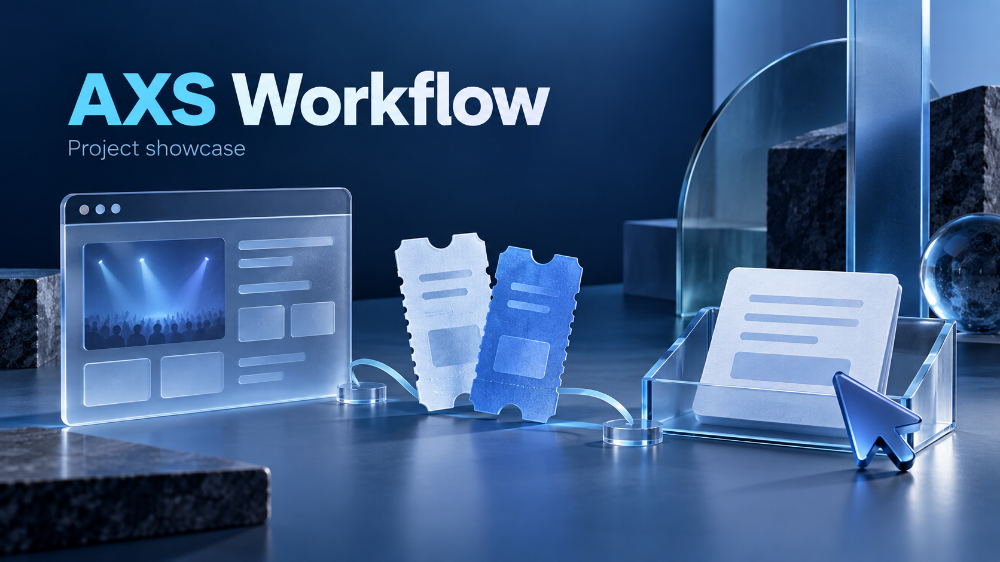
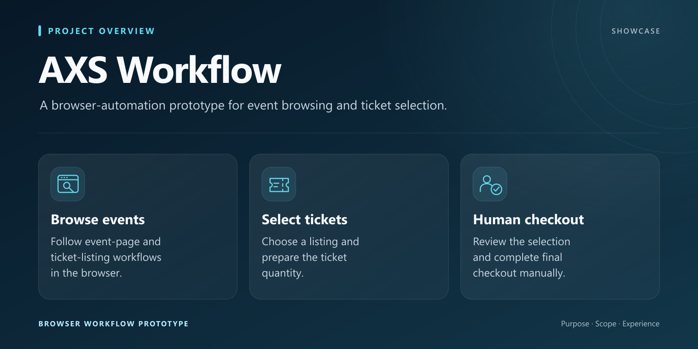
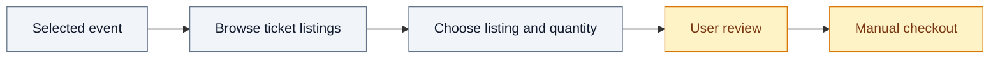

*Concept illustration created for this showcase.*

<h1>AXS Workflow</h1>

<strong>A browser-automation prototype for event browsing and ticket selection.</strong>

  
  
  

## Purpose

AXS Workflow is a Python browser-automation prototype covering event-page browsing and ticket-selection steps. The project includes a local dashboard component and keeps final checkout as a manual action.

Its documented scope follows the transition from an event page to a ticket listing and selection. The public showcase presents that workflow at a product level without exposing operational details.

## Prototype scope

- Event-page and ticket-listing workflows.
- Listing selection and ticket-quantity handling.
- A local dashboard component.
- A manual handoff for final checkout completion.

## Visual overview

## High-level workflow

The browser remains available for the user to review the selection and complete final checkout manually.

## Stack

Python, Camoufox and Requests support the documented browser workflow.

## Development status

Local prototype focused on event browsing and ticket selection, with user-controlled final checkout.

## About this repository

This repository is a public showcase. Only presentation material is published; source code and private data remain private.

**Last showcase review:** 2026-09-12 (Europe/Paris).
