# AXS Workflow

### A local control panel for event browsing, ticket selection and supervised browser sessions

Configure an event, start a browser worker, follow its progress and take over the final checkout in the same browser session.

## What it does

AXS Workflow brings a Python browser workflow into a desktop control panel. The operator can choose an event and ticket quantity, select a seat-selection mode, start or stop the worker, and inspect the process status and output without editing the program for each run.

The browser workflow distinguishes primary ticket sales from resale listings. It handles ticket quantity and selection, then leaves the browser session available for the user to review the order and complete payment. The current payment step is a manual handoff.

## Inside the control panel

| Area | What the operator can do |
|---|---|
| **Process control** | Start the worker, stop its process tree, and check whether it is running. |
| **Live output** | Follow the latest worker messages with automatic refresh and a visible log-size indicator. |
| **Event and tickets** | Set the target event, ticket quantity and best-available or seat-map mode. |
| **Session monitoring** | Inspect active grouped worker sessions and their latest status from a separate panel. |
| **Checkout handoff** | Continue in the existing browser session to review and finish the purchase manually. |

Starting the control panel and starting a worker are separate actions. Loading the page renders the interface and begins status polling; the worker starts only after an explicit Start action.

## How a session moves through the system

1. **Prepare the event.** The operator selects the event and supported ticket preferences in the panel.
2. **Start a supervised worker.** The local service launches the Python worker as a separate process and records its process ID and start time.
3. **Open the ticket flow.** The browser moves from the event page to the applicable ticket interface. Primary sales and resale listings use different selection paths.
4. **Review progress.** The panel refreshes process status and recent output while the visible browser performs the selection steps.
5. **Take over checkout.** The browser remains open for the user to review the selection and complete payment.

```mermaid
flowchart TB
    subgraph Panel["Local control panel"]
        UI["HTML, CSS and JavaScript interface"]
        Settings["Event, quantity and selection mode"]
        Monitor["Process status and live output"]
        UI --> Settings
    end

    subgraph Service["Python service"]
        API["Flask JSON endpoints"]
        Supervisor["Worker start and process-tree stop"]
        Output["Worker output and process state"]
        API --> Supervisor
        Output --> API
    end

    Settings -->|"Explicit Start action"| API
    UI -->|"Periodic status requests"| API
    API --> Monitor
    Supervisor --> Worker["Separate Python browser worker"]
    Worker --> Output
    Worker --> Browser["Visible Camoufox browser session"]
    Browser --> Store{"Ticket interface"}
    Store --> Primary["Primary sale: quantity and seat-selection mode"]
    Store --> Resale["Resale: listing and quantity selection"]
    Primary --> Review["User reviews order"]
    Resale --> Review
    Review --> Payment["Manual payment in the same session"]
```

## Architecture decisions

**The control panel and worker have separate lifecycles.** Flask serves the interface and manages the worker process. The worker owns the browser session. Process supervision uses the operating-system process tree so stopping a run can also stop its child processes.

**The interface observes an existing process.** JavaScript requests status and recent output from JSON endpoints, with the main monitor refreshing every 2.5 seconds. This keeps process state and browser activity visible in one place.

**Ticket interfaces have separate handlers.** The implementation contains distinct paths for resale listings, best-available primary tickets and seat-map selection. A preferred section can be passed to a supported section selector.

**Checkout ends with a human handoff.** The payment-form portion is not implemented as an unattended purchase. The browser session is retained so the operator can complete that step.

## Technology stack

| Layer | Technology and role |
|---|---|
| Control service | Python and Flask serve the panel and JSON endpoints. |
| Interface | Server-rendered HTML with CSS and browser JavaScript. |
| Process supervision | Python subprocess management and psutil monitor and stop worker processes. |
| Browser workflow | Camoufox drives a visible browser session. |
| Supporting HTTP work | Requests is used by the Python worker. |
| Operator feedback | Worker output is read by the service and displayed in the panel. |

## Project status

This is a local workflow prototype. The current implementation includes the control panel, process supervision, ticket-interface handlers and manual payment handoff. There is no verified public hosted application for this project.

## About this repository

This repository presents the application and its architecture. The implementation, operational settings and private records remain private.

**Last showcase review:** 2026-09-12 (Europe/Paris).
